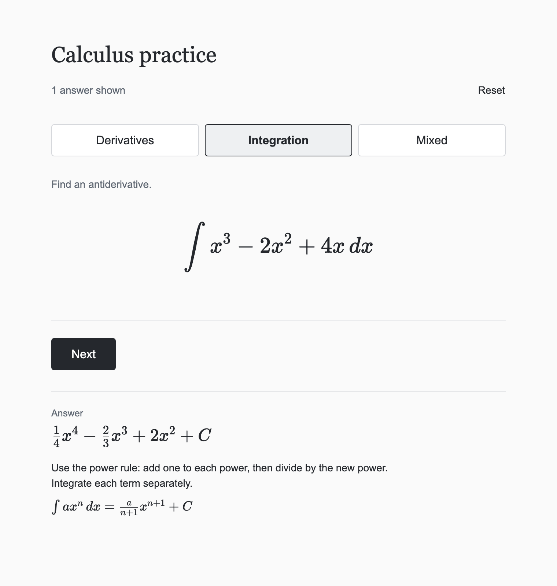

# Calculus practice

**Practice derivatives and indefinite integrals in the browser.** Work each question out in your head, then reveal the answer along with the rule that gets you there.

[](https://bouwles.github.io/calculus-practice/)
[](#play-offline)

<p align="center">
  <a href="https://bouwles.github.io/calculus-practice/">
    
  </a>
</p>

## Features

- **Three modes:** Derivatives, Integration, and Mixed.
- **A new question every time.** Questions are generated at random, and the same question never comes up twice in a row.
- **Every answer explained.** Each answer comes with a one-line explanation and the general rule, typeset with KaTeX.
- **No pressure.** There's no timer, score, or grading. A counter tracks how many answers you've revealed.
- **One file.** The whole app, including scripts, styles, and math fonts, is a single `index.html` with no CDN or server dependencies.
- **Works on phones and laptops.** You can also play it with the keyboard alone.

## What it covers

Coefficients are small whole numbers, up to ±5 (constants go up to ±6). All integrals are indefinite and include `+ C` in the answer.

| Question type | Example | Derivative rule | Integral rule |
| --- | --- | --- | --- |
| Constant | $4$ | $\frac{d}{dx}a = 0$ | $\int a\,dx = ax + C$ |
| Power | $-3x^4$ | $\frac{d}{dx}(ax^n) = anx^{n-1}$ | $\int ax^n\,dx = \frac{a}{n+1}x^{n+1} + C$ |
| Polynomial (2–3 terms) | $x^3 - 2x^2 + 4x$ | Power rule, term by term | Power rule, term by term |
| Sine | $2\sin(x)$ | $\frac{d}{dx}\sin(x) = \cos(x)$ | $\int \sin(x)\,dx = -\cos(x) + C$ |
| Cosine | $-\cos(x)$ | $\frac{d}{dx}\cos(x) = -\sin(x)$ | $\int \cos(x)\,dx = \sin(x) + C$ |
| Exponential | $5e^x$ | $\frac{d}{dx}e^x = e^x$ | $\int e^x\,dx = e^x + C$ |

Powers go up to $x^4$ in derivative questions and $x^3$ in integral questions.

## How to play

1. Pick a mode.
2. Solve the question in your head.
3. Click **Show answer** to check your work against the answer, explanation, and rule.
4. Click **Next** for another question, or **Skip** to move on without revealing the answer.

Focus moves between the buttons as you go, so after your first click you can just keep pressing <kbd>Enter</kbd>. Switching modes keeps your count, and **Reset** sets it back to zero.

### Play offline

Download [`index.html`](index.html) and open it in any browser. It doesn't need an internet connection, an install, or a local server, and you can copy it anywhere.

## Development

You'll need [Node.js](https://nodejs.org/) 22.12 or newer.

```sh
npm ci
npm run dev        # start a dev server with live reload
npm run build      # rebuild the self-contained index.html
npm run preview    # serve the production build locally
```

Edit the files in `src/`. After each change, run `npm run build` to regenerate the root `index.html` (and `dist/index.html`). The root page is committed on purpose: it's both the downloadable file and the page that GitHub Pages serves.

### Tests

```sh
npm test                       # unit tests
npx playwright install chromium
npm run test:browser           # browser tests (desktop + phone)
```

- **Unit tests** check hand-calculated answers and every question family. They also confirm that questions don't repeat, and they verify 1,000 generated questions per mode against an independent symbolic checker.
- **Browser tests** open the actual built page in Playwright and run through every mode, revealing answers by mouse and keyboard. They test Skip and Reset and check the layout on phone and laptop sizes. One test copies the page to another folder to make sure the styles, fonts, and controls still work offline.

### Project layout

```
index.html               Generated, self-contained page (what GitHub Pages serves)
src/
  index.html             Page template
  main.js                UI: rendering questions and the reveal flow
  questions.js           Question generator, answers, and rule explanations
  style.css              Styles
scripts/build.mjs        Bundles with Vite and inlines the JS, CSS, and fonts into index.html
tests/
  calculus.test.js       Unit tests (node --test)
  helpers/answers.js     Independent symbolic checker used by the tests
  browser/game.spec.js   Playwright tests
```

## Built with

- Vanilla JavaScript and CSS
- [KaTeX](https://katex.org/) for math typesetting
- [Vite](https://vite.dev/) for development and bundling
- [Playwright](https://playwright.dev/) for browser tests
